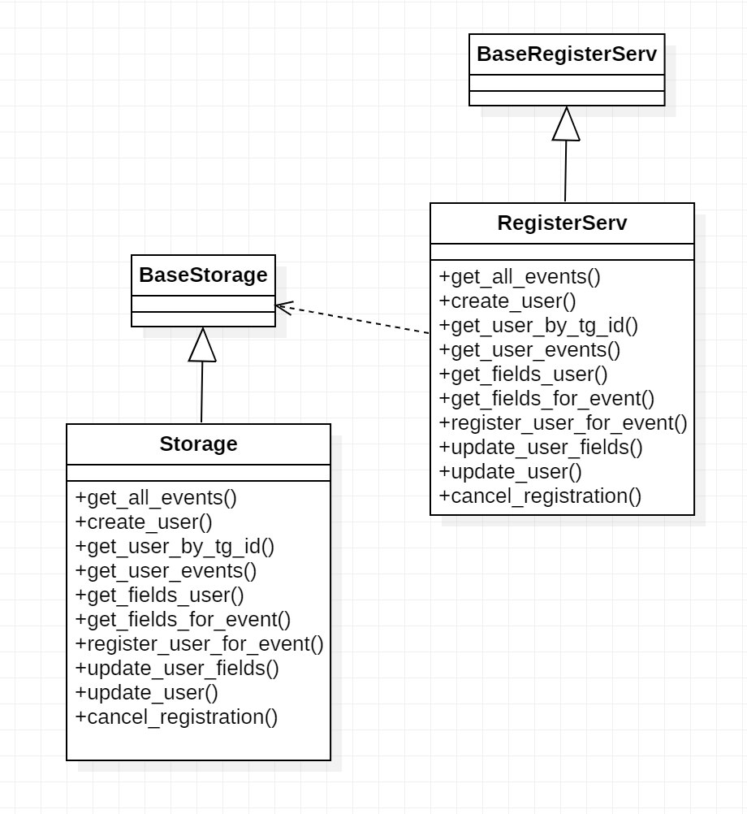

# RegistrationSystemForEvents
Гибкая система регистрации на мероприятий

## Метрик 

### 1. Основные  

| Метрика                          | Формула/Расчет                          | Назначение                                                                 |
|-----------------------------------|-----------------------------------------|----------------------------------------------------------------------------|
| Количество регистраций на мероприятие          | Общее число регистраций на мероприятия               | Оценка общей востребованности мероприятия                                      |
| Регистраций на пользователя       | `Всего регистраций / Уникальные участники` | Анализ вовлеченности и лояльности пользователей                          |
| Процент отмен регистраций         | `(Отмененные регистрации / Все регистрации) * 100` | Отслеживание возникновение проблемы на каком-то из этапов      |

### 2.  мероприятие

| Метрика                          | Формула/Расчет                          | Назначение                                                                 |
|-----------------------------------|-----------------------------------------|----------------------------------------------------------------------------|
| Заполняемость мероприятий         | `(Фактические участники / Макс. вместимость) * 100` | Оптимизация планирования мероприятий и использования площадок       |
| Частота использования полей       | Количество использований конкретного поля в формах | Определение востребованных данных для оптимизации форм регистрации |

### 3. пользователь

| Метрика                          | Формула/Расчет                          | Назначение                                                                 |
|-----------------------------------|-----------------------------------------|----------------------------------------------------------------------------|
| Полнота профиля                   | `(Заполненные поля / Всего полей) * 100` | Анализ вовлеченности пользователей                    |

### 4. Технические 

| Метрика                          | Формула/Расчет                          | Назначение                                                                 |
|-----------------------------------|-----------------------------------------|----------------------------------------------------------------------------|
| Время обработки API               | 95-й перцентиль времени ответа          | Мониторинг производительности системы                                     |
| Частота ошибок                   | `(Ошибочные запросы / Всего запросов) * 100` | Контроль стабильности работы системы                                  |

## Логироване
### **События, которые логируются в системе**

#### **1. Регистрации и отмены**
- **Регистрация на мероприятие**  
  Фиксируется при успешной регистрации пользователя. Содержит ID пользователя, ID мероприятия и список заполненных полей.

- **Отмена регистрации**  
  Записывается при отмене участия пользователем. Включает ID пользователя и ID мероприятия.

- **Автоматическая отмена регистрации**  
  Логируется при системной отмене (например, из-за неактивности пользователя).

#### **2. Действия с профилем**
- **Изменение данных профиля**  
  Фиксируется при обновлении пользователем своих данных (телеграм, группа и др.).

- **Первая регистрация пользователя**  
  Отмечается при первой регистрации пользователя в системе.

#### **3. Ошибки и доступ**
- **Ошибка при регистрации**  
  Записывается при неудачной попытке регистрации с указанием причины.

- **Попытка доступа к закрытому мероприятию**  
  Фиксируется при отказе в регистрации из-за ограничений доступа.

- **Повторная ошибка регистрации**  
  Логируется при нескольких неудачных попытках регистрации подряд.

#### **4. Действия организаторов**
- **Изменение максимальной вместимости**  
  Записывается при изменении организатором лимита участников мероприятия.

- **Изменение полей регистрации**  
  Фиксируется при добавлении/удалении полей в форме регистрации.

#### **5. Системные события**
- **Медленный API-запрос**  
  Логируется при превышении заданного времени обработки запроса.

- **Критическая ошибка системы**  
  Записывается при возникновении серьезных сбоев в работе системы.

#### **Что не логируется**
- Технические операции (бэкапы, ping-запросы)
- Факты отправки уведомлений (логируются только действия пользователей в ответ на них)

## Конечный автомат состояний
[в файле](./avtomat_state.excalidraw)

## Общая UML диаграмма компонентов: бизнес логики, доступ к данным(использование паттерна репозитория)
